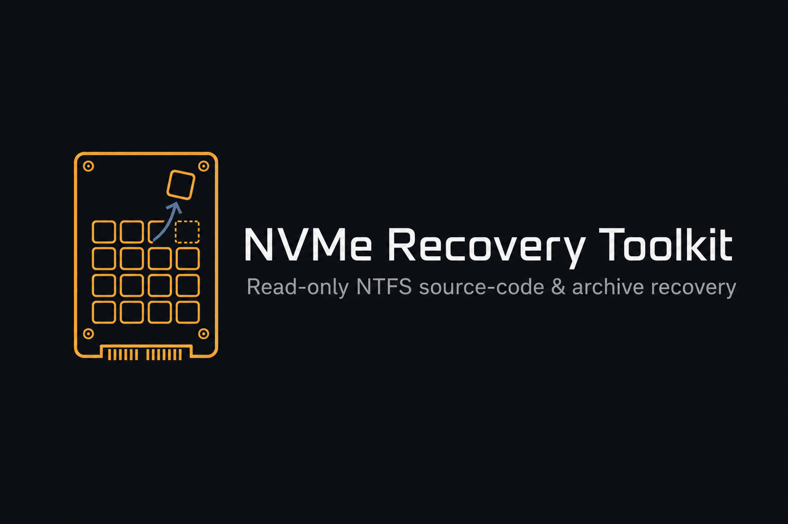
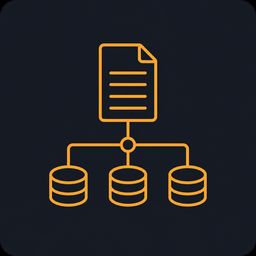
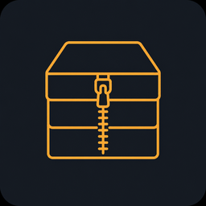

<p align="center">
  
</p>

<p align="center">
  <strong>Read-only forensic recovery of accidentally deleted source code and archives
  from an NTFS volume on an NVMe SSD.</strong><br>
  Built for the Lexar NM620 / Innogrit IG5216 (DRAM-less, TRIM-enabled) mass-deletion scenario.
</p>

<p align="center">
  
  
  
  
</p>

---

## Overview

You deleted roughly 100 GB of `.rs / .kt / .py / .sol` source and `.zip / .7z`
backups on a TRIM-enabled NVMe drive, rebooted once, then hard-powered-off. This
toolkit provides the highest realistic chance of recovering that source code using
software alone, by attacking the recovery vectors that generic carvers
(PhotoRec, EaseUS, Disk Drill) miss.

The workflow is two steps and never touches the original drive after imaging:

```
   Power off the drive  ->  Image it read-only  ->  Recover from the image
        (done)                01_image_drive.sh        02_run_recovery.sh
```

---

## Why this works — the $MFT vector

Most guides stop at *"TRIM means the data is gone, send it to a lab."* That is only
half the story. The critical fact:

> TRIM / DEALLOCATE frees the deleted files' **data clusters** — it does **not**
> deallocate the `$MFT` system file itself.

So even when the data area reads back as zeros:

| Frequently survives TRIM | Usually wiped by TRIM |
| --- | --- |
| `$MFT` records of deleted files (names, paths, sizes) | the bulk file **data clusters** |
| **Resident** small files — content stored *inside* the MFT record | large non-resident file bodies |
| `$UsnJrnl` change journal (timestamped delete log) | |

Many source files are small enough to be stored **resident** inside their MFT
record, which means they are recovered **fully intact, with their original
filename and path**, even on a drive where the data area has been zeroed. That is
the realistic win this toolkit is engineered around.

---

## Pipeline

```
        +---------------------------------------------------------------+
        |            DAMAGED Lexar NM620 512GB  (keep powered OFF)       |
        +-------------------------------+-------------------------------+
                                        |  connect to Linux, do NOT mount
                                        v
        +---------------------------------------------------------------+
        |  STEP 1   01_image_drive.sh                 [ READ-ONLY ]      |
        |  devices  ->  state  ->  image                                |
        |  blockdev --setro -> SMART/TRIM capture -> ddrescue -> sha256 |
        +-------------------------------+-------------------------------+
                                        |  rescue-nvme0n1.img  (work on THIS)
                                        v
        +---------------------------------------------------------------+
        |  STEP 2   02_run_recovery.sh   ->   nvme_recover.py           |
        |                                                               |
        |  analyze  ->  mft  ->  usn  ->  archives  ->  source          |
        |  (where's    (intact  (delete   (zip/7z/     (.rs/.kt/        |
        |   the data?)  files)   log)      gzip)        .py/.sol)       |
        +-------------------------------+-------------------------------+
                                        v
                          recovered/  (your files + manifests)
```

---

## Recovery vectors

<table>
  <thead>
    <tr><th width="64">&nbsp;</th><th>Command</th><th>What it does</th></tr>
  </thead>
  <tbody>
    <tr>
      <td align="center"></td>
      <td><code>analyze</code></td>
      <td>Zero / <code>0xFF</code> / entropy map of the image: shows how much TRIM
      wiped and <em>where</em> live data sits. Writes <code>regions.json</code> to
      fast-path every later phase.</td>
    </tr>
    <tr>
      <td align="center"></td>
      <td><code>mft</code></td>
      <td>Scans <code>$MFT</code>: recovers <strong>resident files intact</strong>;
      for non-resident files it lists the exact clusters and can targeted-carve
      them with <code>--carve-nonresident</code>.</td>
    </tr>
    <tr>
      <td align="center"></td>
      <td><code>usn</code></td>
      <td>Parses the <code>$UsnJrnl</code> change journal into a timestamped
      <strong>delete log by filename</strong>.</td>
    </tr>
    <tr>
      <td align="center"></td>
      <td><code>archives</code></td>
      <td><strong>ZIP</strong> (central-directory reconstruction + per-member
      salvage), <strong>7z</strong> (CRC-validated, exact size from header), and
      <strong>gzip</strong> stream recovery.</td>
    </tr>
    <tr>
      <td align="center"></td>
      <td><code>source</code></td>
      <td>Language-aware carving of raw bytes into buckets:
      <code>.rs / .kt / .py / .sol / .go / .js / .c / .json / .toml / .md</code>.</td>
    </tr>
  </tbody>
</table>

Two convenience commands tie these together:

- `all` — runs every phase in the optimal order and writes `RECOVERY_SUMMARY.txt`.
- `selftest` — builds a synthetic image and proves every vector works (no drive needed).

---

## Requirements

Run from a **Linux live USB** (SystemRescue / Ubuntu / Mint). Do not boot the
affected Windows installation.

```bash
sudo apt update && sudo apt install -y gddrescue nvme-cli gdisk python3 p7zip-full
```

| Package | Purpose |
| --- | --- |
| `gddrescue` | provides `ddrescue` (the imager) |
| `nvme-cli` | SMART / id-ctrl / TRIM-state capture |
| `gdisk` | GPT partition-table backup (`sgdisk`) |
| `python3` | the recovery engine (3.6+, **standard library only**) |
| `p7zip-full` | optional — to *extract* carved `.7z` (carving works without it) |

---

## Usage

### Step 1 — Image the drive (read-only)

```bash
chmod +x 01_image_drive.sh 02_run_recovery.sh

./01_image_drive.sh devices                       # identify your /dev/nvmeXn1
./01_image_drive.sh state /dev/nvme0n1 /mnt/dest   # capture SMART/TRIM evidence (optional)
./01_image_drive.sh image /dev/nvme0n1 /mnt/dest   # -> /mnt/dest/rescue-nvme0n1.img (+ .sha256)
```

Safety is enforced: the script refuses if the source is mounted or if the
destination lives on the source disk, force-sets the source read-only
(`blockdev --setro`), and only ever issues READ commands — never TRIM/discard.
The destination must be a separate, larger disk you can write to.

### Step 2 — Recover (operates on the image only)

```bash
./02_run_recovery.sh /mnt/dest/rescue-nvme0n1.img /mnt/dest/recovered
```

Optional extra pass — also pull non-resident file bodies from their exact
clusters (may be zeros if TRIM completed, but worth one attempt):

```bash
python3 nvme_recover.py mft \
    --image /mnt/dest/rescue-nvme0n1.img \
    --out   /mnt/dest/recovered \
    --carve-nonresident
```

### Step 3 — Find your files

```bash
# grep the whole recovery tree for a string you know was in your code
grep -rIl 'someUniqueFunctionName' /mnt/dest/recovered
```

---

## Output layout

```
recovered/
+-- 00_analysis/
|   +-- regions.json          <- live-data map (speeds up later phases)
|   +-- summary.txt           <- "how much did TRIM wipe?" verdict
+-- 10_mft/
|   +-- files/                <- deleted files recovered WITH original names
|   +-- mft_manifest.csv      <- every deleted file found (your lost tree)
|   +-- usn_journal.csv       <- timestamped delete log
+-- 20_archives/
|   +-- zip/                  <- rebuilt .zip (members extracted)
|   +-- zip_members/          <- individual files salvaged from broken zips
|   +-- 7z/                   <- carved .7z (extract with: 7z x)
|   +-- gzip/                 <- decompressed gzip streams
+-- 30_source/
|   +-- rust/ kotlin/ python/ solidity/ go/ javascript/ ...
|   +-- source_manifest.csv   <- offset, language, confidence, preview
+-- RECOVERY_SUMMARY.txt
```

---

## Verify it works (no drive needed)

```bash
python3 nvme_recover.py selftest --out /tmp/nvme_selftest
```

Builds a synthetic NTFS-style image and asserts: resident MFT files recovered
byte-for-byte, USN delete event parsed, ZIP reconstructed with members extracted,
and source fragments correctly language-classified. Prints `ALL TESTS PASSED`.

---

## Command reference

```text
python3 nvme_recover.py <command> --image  --out <DIR> [options]

  analyze   --block-size N             zero/entropy region map
  mft       [--carve-nonresident]      $MFT mining (+ optional cluster carve)
            [--cluster-size N] [--mft-offset N]
  usn                                  $UsnJrnl delete log
  archives                             ZIP / 7z / gzip carving
  source    [--include-unclassified]   language-aware source carving
  all       [--carve-nonresident]      full pipeline + summary
  selftest                             self-validate the engine

  common:   --regions <regions.json>   restrict scan to live extents (faster)
```

---

## Realism assessment

- **Bulk data area.** On a TRIM-completed NVMe, deleted data clusters most likely
  read back as zeros (deterministic read after TRIM). Raw `source` carving and
  `--carve-nonresident` may find little there. The pessimistic write-ups are
  correct about this part.
- **Where the hope is.** The `$MFT` resident files and the `$UsnJrnl` routinely
  survive, and they are exactly where small source files come back intact.
- **What to do.** Run `analyze` first. If the dead (zero/`0xFF`) percentage is
  below 99 percent, the odds climb sharply. The cost of trying is one image plus a
  few CPU hours.
- **If software comes up empty.** The only remaining path is a lab with PC-3000
  SSD tooling and an Innogrit IG5216 controller-bypass profile for a raw-NAND read.
  Keep the drive unpowered until then.

---

## Safety rules

1. Never work on the original drive — image first, recover from the image.
2. Never mount the damaged drive read-write; do not run `fstrim` or `ntfsfix` on it.
3. Keep the source powered off between attempts.
4. The destination disk must be separate and at least as large as the source.

---

## Project layout

```
nvme-source-recovery/
+-- README.md
+-- LICENSE
+-- nvme_recover.py        recovery engine (MFT + USN + archives + source)
+-- 01_image_drive.sh      read-only ddrescue imaging + controller-state capture
+-- 02_run_recovery.sh     one-command pipeline runner
+-- assets/                logo, mark, and vector icons used by this README
```

---

## License

MIT — provided as-is, for recovering data you are authorized to access
(for example, your own accidentally deleted files). No warranty.
